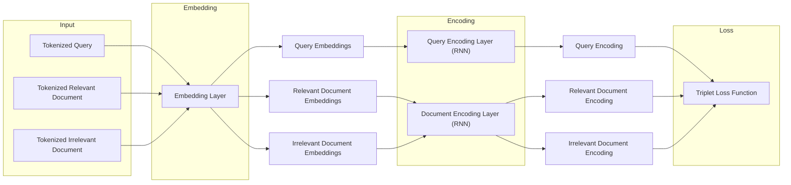

# MLX8-W2-DocumentSearch

https://cortex.mlx.institute/m/179/l/204/e/3

## The Two Tower Architecture

This week's architecture is called a _Two Tower_ architecture and, for our task, looks something like the picture below.

- We start by taking our triple of (query, relevant document, irrelevant document) which should be tokenized.
- We feed it into an _embedding layer_ to turn each query and document into a list of its constituent token embeddings. This embedding layer could be a _word2vec_-style embedding layer which you pretrain, and then freeze (or fine-tune) its weights for (in) the downstream task.
- We then make separate _RNN_ encoders for the queries and documents. We feed the query token embeddings to the query encoder to get a query encoding, and each set of document token embeddings to the document encoder to get a document encoding. These two separate encoders give the architecture its name as a _Two Tower_ network. The reason for separate encoders is to capture the fact that queries and documents tend to have different semantic and syntactic structures, and so may need to be encoded differently.
- Finally, we pass the encoded query, relevant document, and irrelevant document to the _Triplet Loss Function_ in order to do backpropagation and update the parameters of our two encoders. We will discuss this more in the lesson on _Training_.

The key component of both of our encoders is a neural network called an **RNN**, which is constructed to encode sequential data in such a way as to preserve information about the sequential structure (like the order of tokens). Our data—both queries and documents—consists of a sequence of token embeddings, and so is perfectly suited to be encoded by an RNN.

We will discuss more about how an RNN works in the next lesson.

