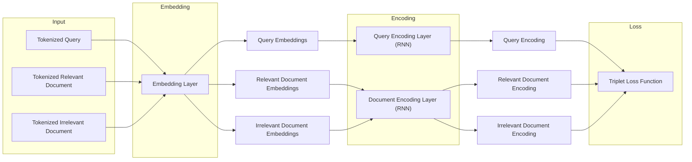

# MLX8-W2-DocumentSearch

https://cortex.mlx.institute/m/179/l/204/e/3

```mermaid

flowchart LR
    subgraph Input
        A1["Tokenized Query"]
        A2["Tokenized Relevant Document"]
        A3["Tokenized Irrelevant Document"]
    end

    subgraph Embedding
        B["Embedding Layer"]
    end

    subgraph Encoding
        C1["Query Encoding Layer (RNN)"]
        C2["Document Encoding Layer (RNN)"]
    end

    subgraph Loss
        D["Triplet Loss Function"]
    end

    %% Input to Embedding
    A1 --> B
    A2 --> B
    A3 --> B

    %% Embedding output
    B --> E1["Query Embeddings"]
    B --> E2["Relevant Document Embeddings"]
    B --> E3["Irrelevant Document Embeddings"]

    %% Encoding layers
    E1 --> C1 --> F1["Query Encoding"]
    E2 --> C2 --> F2["Relevant Document Encoding"]
    E3 --> C2 --> F3["Irrelevant Document Encoding"]

    %% Final loss
    F1 --> D
    F2 --> D
    F3 --> D

```
